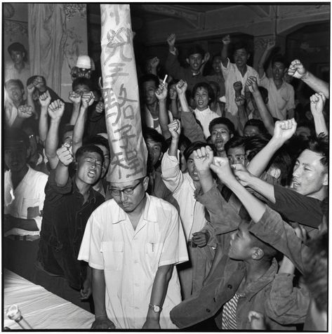
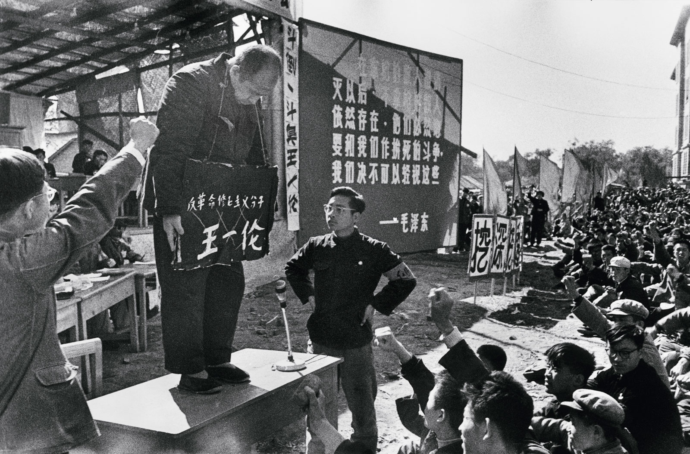

 <!-- Personal experience -->

Free speech. Due process. Democracy. These are the
cornerstones of the miracle of
modern civilization, and the [Enlightenment
Age](https://en.wikipedia.org/wiki/Age_of_Enlightenment). They are the
reasons why people from all over the world flee their countries to the
west, to finally be themselves, without the crippling fear of prosecution for
speaking their mind.

I grew up in Saudi Arabia and Egypt, two countries with
strong religious and political orthodoxies, where you always had to be
careful what you say, and who you say it to. You had to live double
lives, saying what you need to say, not what you really think. If you
did otherwise, saying something not conforming with the (religious) status quo, you risked losing your friends, your
family, your job, and quite possibly your freedom.

Sarah Hegazi was an Egyptian lesbian activist. Attending a concert in
Cairo in 2017, she let her guard down and showed her real self for a moment, waving
the pride flag. Sarah was arrested and imprisoned for 3 months for
"inciting acts of immorality". Suffering badly from PTSD after her arrest, [she took her life
less
than 3 years
later](https://www.washingtonpost.com/world/2020/06/16/sarah-hegazi-egypt-pride-flag-suicide/).

---

## Groupthink

In the name of inclusion, we are moving very fast in the direction of
groupthink. "Words are violence". "Silence is violence".
"Microagressions". This builds a fragile, tribal society where people
are terrified of saying anything that goes against commonly held
ideas. This is how you stifle and kill progress, and how liberal
democracies die.

We are veering uncomfortably close to George Orwell's _1984_, where the
"Thought police" punishes "thought crimes" that challenge the status
quo. It seems dystopian and scary to read because we are all scared of
being policed by _them_. How scary is it when the religious right
tries to ban talking about homosexuality, birth control, atheism?
pretty scary, right?

_Cancelling_ someone based on some opinions they had that don't match
the status quo, some tweet they wrote 10 years ago, something they
said that made you feel uncomfortable is extremely dangerous. It is based
on the idea of _purity_, where some people are pure, while others are
irredeemably racist, sexist bigots that need to be punished and cast
aside. That concept is obviously false, and is the opposite of
empathy. It will lead to a destructive spiral where we're always
looking for the next target to cancel. It sounds great until it's your
turn, and your turn will eventually come, because over your lifetime,
it is impossible for you to have never held a (now) despicable view,
or said something terrible you deeply regret that people are yet to
discover.

## Radicalization breeds radicalization

[People are reciprocal by nature](https://en.wikipedia.org/wiki/Reciprocal_altruism_in_humans). The only way to change someone's
mind and help them see your point is to show them that you're also
willing to see their point. Only then do they let their guard down and
are willing to reach a mutual agreement.

Another phenomenon we're emulating is teenage bullying. In school,
there are usually people who get bullied and silenced by one dominant
group. Everyone else is afraid to be the next victim, so they join
along with the bullies to protect themselves. When your friend is the
target of the latest bullying round, you have to disown them and sometimes
even join in the bullying , because otherwise the mob will come for
you too. [This is how mobs are
made](https://www.psychologytoday.com/us/blog/the-couch/201908/what-makes-someone-support-bully).

Incidentally, [high school kids are being openly encouraged
to to serve the ideology and _expose_ their
classmates](https://www.nytimes.com/2020/06/16/style/blm-accounts-social-media-high-school.html),
not dissimilar to Mao's teenage [Red
Guards](https://newint.org/features/1987/04/05/teenage), or the [Hitler
Youth](https://en.wikipedia.org/wiki/Hitler_Youth).

## None of this is new

> "Those who cannot remember the past are condemned to repeat it." ―**George Santayana**

In general, an extremely small percentage of people genuinely
evil. This applies to all groups, Social Justice Warriors included. So
I'm not here to demonize them. I think they really believe that injustices are inflicted by a few evil
intolerant minority (usually referred to as _Them_), and if we just get rid of that minority, we'll
finally have a tolerant and just world.

https://twitter.com/clairlemon/status/1269528668495208449

But unfortunately, this overly simplistic
view has always existed in political systems throughout history, and
as you might imagine, it always ends up with disastrous
consequences. Whether it's [_The Rich_](https://en.wikipedia.org/wiki/Kulak), [_The
Jews_](https://en.wikipedia.org/wiki/The_Holocaust), [_The
Tutsis_](https://en.wikipedia.org/wiki/Rwandan_genocide), or [_The
Bourgeoisie_](https://en.wikipedia.org/wiki/Cultural_Revolution), history is
littered with precedents.

## The cycle is happening again in full force

https://twitter.com/Laelaps/status/1269414427696050178

> "When the penalty for speaking one’s mind is so great, nobody knows
> what anybody else thinks" —[Life and Death in Shanghai](https://www.goodreads.com/book/show/537404.Life_and_Death_in_Shanghai%0A)

It is truly worrying that this kind of intolerance is
most
common in
academia, media, journalism, and tech industries. Specifically, fields that thrive on
innovation, and free and open exchange of ideas and challenging views.
If the most liberal fields become the most dogmatic, what hope do we
have for the rest?

[A recent Washington Post article argued J.K Rowling should just stop
writing](https://www.washingtonpost.com/opinions/2020/06/09/jk-rowlings-transphobia-shows-its-time-put-down-pen/).
That's J.K Rowling, [arguably the most successful author alive](https://en.wikipedia.org/wiki/List_of_best-selling_fiction_authors).

### Cleansing history

> "Every record has been destroyed or falsified, every book has been
> rewritten...every statue and street and building has been renamed,
> every date has altered. And that process is continuing day by day
> and minute by minute. History has stopped."

[A university hall was renamed in Liverpool, because it was named after
a 19th century prime minister, because _ his father_ was involved in slave trading.](https://twitter.com/maxclementsECHO/status/1270391104022745088)

This _cleansing_ movement is characterized by a moral clarity that there's only one side to be
on. The same kind of moral clarity is usually found in every cult, every
extreme religious group, every authoritarian regime. They all share
the belief that there's two kinds of people in this world, good
(who belong to our group) and evil (everyone else). That it is time
_we_ took control, and
_they_ got what's coming for them.

---

## Cynicism

We've become predators, waiting for the slightest opening to jump on
the next prey, always assuming bad intent, losing our ability to
have a conversation. This is not how we proser as a society. It's how we turn
into mass-scale Mean Girls.

That is the difference between mature adults and bullies. Adults talk,
they argue their positions and try to reach an agreement. Bullies look
for any sign to attack the other person with (notice they always
attack people, not arguments). They don't try to convince you why
your opinion is wrong, they try to _get_ you using anything you say or
do, and then immediately attack you (with their gang amplifying the
attack).

## The cynical religion

Woke culture shares a lot of similarities with religion. It seems like
we cannot really live without religions, we just replace them with new
ones.

The Woke religion also features sins, _superior_ moral
values, and a call for justice by punishing the sinners.
But in a way, it's an inferior model than abrahamic religions.
In the Woke cult, there's no redemption. You cannot atone for your
sins, only be forever disgraced and exiled.

In the cult of Wokeness, you are defined by the worst thought you ever had.
Not your actions. Not the average of all your thoughts. Not your
current thoughts. If you said something 10 years ago that we now deem racist,
then you're a racist bigot and that's how you'll always be. It is the
epitome of cynicism.

> "Goodness is, one might say, the unique consequence of a keen and
> ongoing awareness of one’s capacity to be bad, that is, to be
> thoughtless, cruel, self-righteous and deaf to the legitimate needs
> of others" —[The Book of Life](https://www.theschooloflife.com/thebookoflife/the-one-question-you-need-to-ask-to-know-whether-youre-a-good-person/)

Cults depend on the total conformity and obedience of their members. So when you voice an
opinion that does not completely conform with the the narrative, you
become a threat to the group who has to be swiftly
punished.

## Where do we go from here?

[There's hope](https://harpers.org/a-letter-on-justice-and-open-debate/).

> "The way to defeat bad ideas is by exposure, argument, and persuasion, not by trying to silence or wish them away."

> "banning speech does not quash the ideas behind it: it simply drives
> them underground, where they fester unopposed." **—Jerry Coyne**

> Goebbels was in favor of free speech for views he liked. So was
> Stalin. If you’re really in favor of free speech, then you’re in
> favor of freedom of speech for precisely the views you despise. **—Noam Chomsky**

> "If liberty means anything at all, it means the right to tell people
> what they do not want to hear." **—George Orwell**

It is quite depressing to see how committed we are to repeating the
same mistakes over and over, replacing one cult with another. How we look at hundreds of
historical precedents, or many existing examples (Chinese Communist
Party, or almost any third world country), or novels like
1984 showing us exactly how this will go, and still ignore all of that
, thinking naively this time it's different. Yet
again.

> “An appeaser is one who feeds a crocodile—hoping it will eat him
> last.” **—Winston Churchill**

It might be tempting to think that if you're just careful about what
you say & do, you'll be fine. But you can't sit this out. You can sit in silence and nod along
thinking that you'll be exempt. Such movements never stop, and they
will continue looking for the next _impure_ target to destroy. It's a
numbers game, and sooner or later, it'll be your turn. The time to
speak up is now.

> "people who cannot speak freely will not be able to think clearly,
> and no society can long flourish when contrarians are treated as
> heretics."
> —[Bret Stephens](https://www.nytimes.com/2020/07/03/opinion/orwell-fourth-of-july.html)

A society that favors some groups over others is never a civil one. It
always ends up with groups struggling for power, and taking "revenge"
on other groups once they get it. It's a vicious cycle, and if we
start it again, it might be the end of western civilization.

If you want a tolerant society, start with yourself. Believe in the
good in people. Assume good intent. If Someone says or does
something you think is unacceptable, try to empathize and think why they would do that.
Resist the temptation to
settle for the basic "because they're bad" explanation, dig deeper and
try harder. We can do better. We can break the cycle of intolerance.

https://twitter.com/ConceptualJames/status/1275236906591227905

If you're calm because you think that Nazi Germany, Mao's China, or
the French Revolution cannot possibly happen again, then think again.
There's nothing magically different about us, and this movement is not going to
die on its own. It will only grow more powerful and violent with time,
so the time to speak up is now.

Conforming with the group is the natural, instinctive thing to do. Going against it [takes a
mental toll on
you](https://www.sciencedirect.com/science/article/abs/pii/S0277953620302355).
But we don't have to blindly conform. We don't have to
be authoritarian and attack those who stray away. It is not a given.

It's worth noting that these incidents are not new, but the number of
people who lost their jobs and livelihoods because they had an opinion
that offended someone is rising exponentially, signaling a complete
breakdown in our ability to have real and meaningful debates.

## Authoritarianism

Authoritarianism is generally regarded as a trait of the conservative
right, and it's the liberal left that fights for free speech and a
healthy debate of ideas. But [Authoritarians are just as likely to
exist on the
left](https://www.newstatesman.com/international/2020/05/there-such-thing-left-wing-authoritarian)

> If liberty means anything at all, it means the right to tell people
> what they do not want to hear. —**1984**

## The Irredeemables

An LA Galaxy football player Alexander Katai,
whose wife posted on Instagram insulting rioters and protesters. Katai
then posted a four-paragraph
apology, calling his wife’s views “unacceptable” and
"not tolerated in his family". [He was fired
anyways](https://www.nationalreview.com/corner/los-angeles-galaxy-releases-aleksandar-katai-over-wifes-instagram-posts/).

Do you know who else punishes people for their family members'
transgressions? Totalitarian regimes.

[More examples of the censorship behavior can be found in this twitter
thread.](https://twitter.com/SpeechUnion/status/1269314030663012352)

Silencing individuals that challenge the status quo and controlling their
speech is nothing new. It is the most common behavior throughout
history. We see it again and again, wherever we find groups. Whether
it's religions silencing _blasphemy_, authoritarian states silencing
dissenters, school bullies, etc.

## Idea contagion

> [It is now quite common among journalists to think of opinions not as arguments to be advanced, engaged with, and potentially refuted, but as a kind of viral propaganda with the power to convert readers](https://theweek.com/articles/918140/when-journalists-stop-believing-debate)

There's a reason for that. If
you think about ideas like you think about viruses, spreading contagiously and
able to contaminate hosts exponentially, then
on the surface, it seems like the most efficient way to eradicate an
idea is to kill (or silence) the hosts.

But Here's where this analogy falls apart. Unlike viruses,
ideas don't die when you kill the host. They get stronger. Moreover,
this theory is
predicated on a condescending assumption that the public will be helplessly
'infected' by this dangerous idea, and they're incapable of
understanding it or seeing through it.

[Studies show people with higher cognitive abilities tend to be in
favor of free
speech](https://heterodoxacademy.org/social-science-freedom-of-speech/).

> higher cognitive ability was associated with liking ‘liberal’ groups and disliking
> ‘conservative’ groups.
>
> Nevertheless, higher cognitive ability was related to more strongly
> endorsing free speech rights for all social groups, even for social groups they relatively dislike.

Only when you lack the ability to make a convincing argument, does it make sense to
silence the other one.

## Total conformity or exile

Cults depend on the total conformity and obedience of their members. So when you voice an
opinion that does not completely conform with the the narrative, you
become a threat to the group who has to be swiftly
punished.

Left-leaning data Scientist David Shor, who worked for Obama, recently
tweeted a study that suggested violent protests
were electorally counterproductive to Democrats, recommending peaceful protest
instead. Some employees at his firm complained that his
tweet made them feel unsafe.
A few days later, [Shor was swiftly fired](https://nymag.com/intelligencer/amp/2020/06/case-for-liberalism-tom-cotton-new-york-times-james-bennet.html).

The study
Shor shared was authored by a black author. Other studies have also shown [extreme protest actions
reduce popular support for social
movements](https://psycnet.apa.org/record/2020-02398-001), and surveys
show [violent
protests are unpopular in _every_ demographic
group](https://www.theatlantic.com/ideas/archive/2020/06/police-reform-popular-rioting-not/612580/).
Shor even [publicly apologized for sharing the study](https://twitter.com/davidshor/status/1266448606321664004).
But none of that mattered. Shor had already signaled that his
disobedience to the narrative.

When was the last time you witnessed a civil, nuanced discussion on a
controversial topic on social media? We're becoming more and more
isolated, with camps on each side thinking the other side is the devil
incarnate, without ever listening to what they have to say.

We need to let people make mistakes, and reduce the cost of publicly expressing a
"wrong" opinion. The higher that cost, the more deviation we'll have
between what people think and what they say, and we'll end up with a
hypocritical society.

## WIP

An exercise for you, to reduce your own polarization, is to think of the
strongest political position you have, and think about counter arguments
to that position. Imagine your life depended on you making a
convincing counter argument
