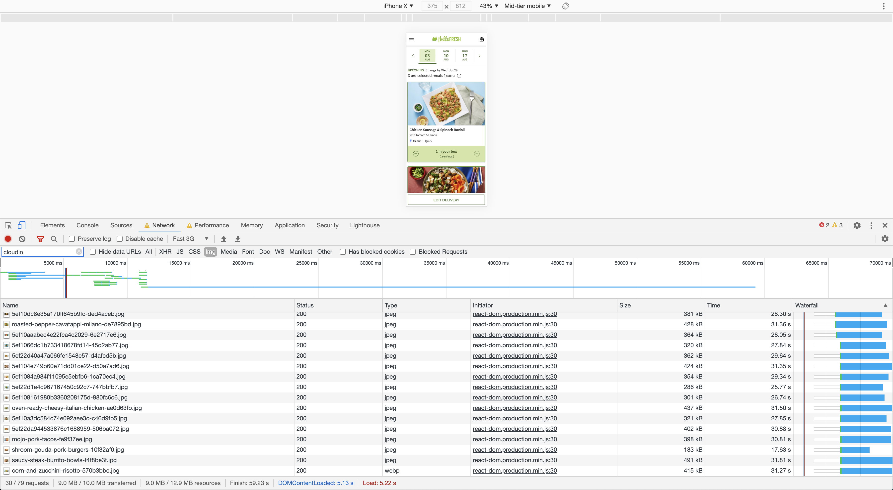
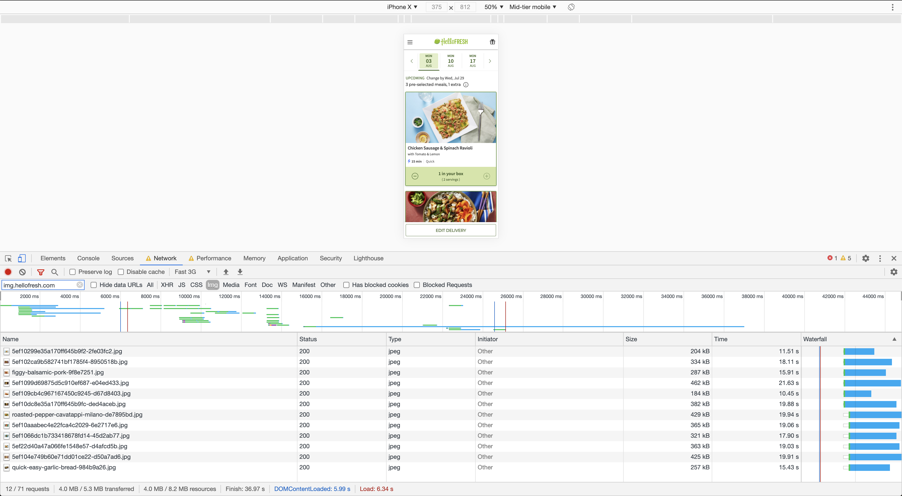

According to
[HTTPArchive](https://httparchive.org/reports/page-weight), images are
the heaviest and most requested asset type for most websites. In a lot
of cases, users download many below-the-fold images before they start
interacting with the page, leading to slower load times, and higher
bandwidth and memory usage.

Image lazy loading is a new browser feature that lets you skip
downloading off-screen images until the user scrolls near them. All by
adding a single attribute `loading="lazy"` to your `` elements.

```html

```

At HelloFresh, we offer our users a weekly selection of recipes to
choose from. As we expand our
offering, more and more recipes are added to the menu page, reaching 40+
recipes in some cases. This led to users having to download a lot of images, even if they never get to see
them, making menu expansion inversely correlated with user experience.


Consequently, image lazy loading seemed perfect for our use case. So we went ahead and added the `loading="lazy"` to our recipe card
components, then did a benchmark to compare the results on our initial
load times, which were
the following:

## The numbers

### Without lazy loading



- _30_ recipe image requests
- for a total of _9MB_
- taking _60 seconds_ to finish initial loading

### With lazy loading



- _12_ recipe image requests (**60% decrease**)
- for a total of _4MB_ (**56% decrease**)
- taking _36 seconds_ to finish initial loading (**40% decrease**)

As you can see, the effect is quite significant, and gets more and
more magnified the more images you add to your web page.

## Trade offs

Lazy loading can drastically improve _initial_ page load
time, in other words, reducing the time it takes for _something_ in
the page to be interactive.

However, of course, as with everything, nothing comes for free. The
caveat here is that if the
user's internet connection is slow, they'll scroll down to see the
other recipes, only to find empty images that they still would need to
wait for to be downloaded.

And some users would prefer to let the page take
its time to download its content at one go, and to be fully
interactive afterwards. One example is when you load the page on a
fast connection, then go somewhere with a patchy connection (such as
underground trains), only to scroll down and find that a big part of the page is still
not fully downloaded or interactive.

However, this is the trade-off you get with deferred loading and code
splitting in general, so it's not specific to this particular
attribute.

In our case, we thought that even if in some edge cases the user
experience could be degraded, for most users the experience would be substantially
faster and less resource intensive, making the trade-off worth it
overall.

## Browser support

Image Lazy loading is currently supported by [Chrome, Edge, Firefox, and
Opera](https://developer.mozilla.org/en-US/docs/Web/HTML/Element/img#Browser_compatibility). It is backwards compatible, so if the browser doesn't support
it, it will just fall back to the default "eager" loading behavior.
You can also add [a polyfill](https://github.com/aFarkas/lazysizes) if
you wish to support other browsers.

## Conclusion

In many cases, improvements in web
performance require sophisticated solutions by experienced engineers, which
makes them harder to adopt in most websites.

It's quite
rare to reap such impressive performance gains by adding a single (backwards compatible) line
of code. The return you can get for such low investment makes
image lazy loading one of the best low-hanging fruits when it comes to
improving web performance.

If your website loads multiple
below-the-fold images, and you're looking for an easy performance gain, I would highly recommend taking a look at image
lazy loading.

_For more technical details about how native lazy loading works, I
recommend checking
out [this article](https://web.dev/native-lazy-loading/)._
