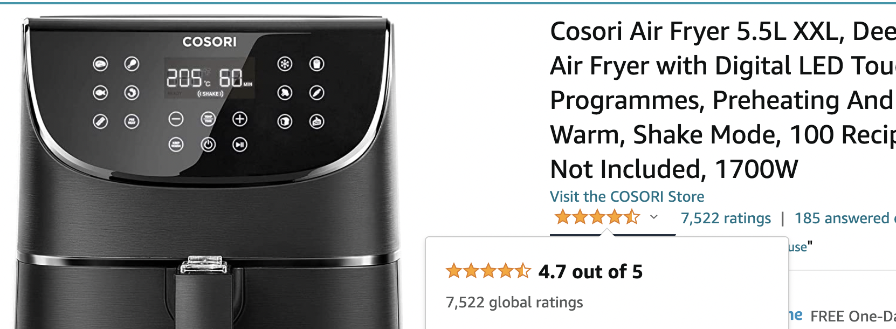
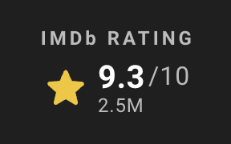
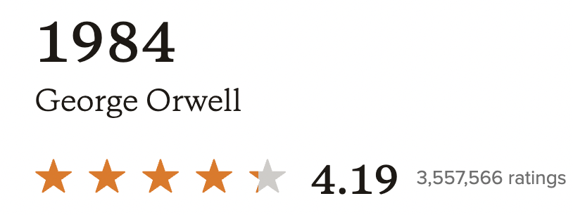
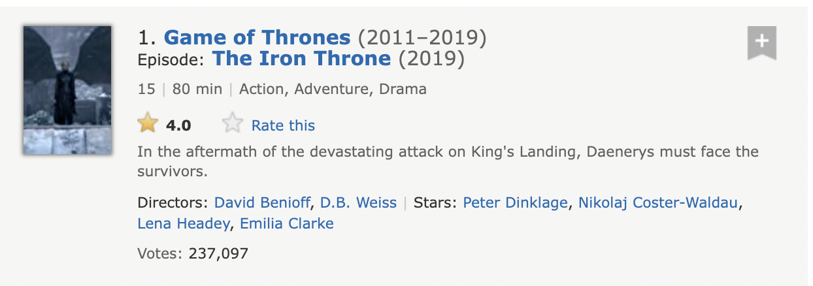
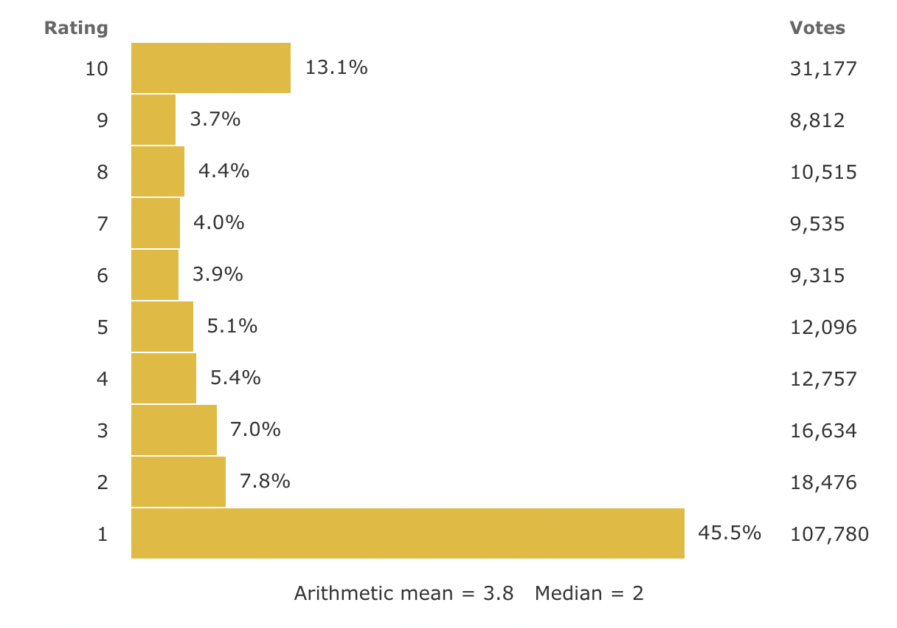

## What

> When an option is chosen from alternatives, the opportunity cost is the "cost" incurred by not enjoying the benefit associated with the best alternative choice.

Opportunity Cost, Fear Of Missing Out (FOMO), Choice Paralysis. All these
phenomena have gained more relevance in the modern
world. They all stem from the idea that your time is finite,
and you have infinite ways to spend it. How do you spend most enjoyably, while having little regrets?

The more choices you have,
the more time and mental energy it takes you to decide, and [the more
dissatisfaction and regret you have with your
decision](https://web.archive.org/web/20131130195656/http://www.columbia.edu/~ss957/articles/Choice_is_Demotivating.pdf).
Michael Stevens had a nice demonstration of that on his Mind Field
show, which I recommend [checking out](https://youtu.be/lmI7NnMqwLQ?t=206).

As the world moves into more and more prosperity, we're faced with
more choices and decisions to make than ever. Wanna watch a movie?
IMDb has [6.5 Million movies to choose
from](https://www.imdb.com/pressroom/stats). Wanna read a book? just
pick one from the [2.6 _billion_ available on Goodreads](https://www.goodreads.com/about/us).

## How

**Note**: _I'll be using the term **product** to denote the items being reviewed, but it doesn't have to be a physical product, it can be a movie, a book, an experience or a tourist destination. The methodology used to determine quality stays the same._

Websites that offer a directory of items with ratings usually have two numbers to gauge an item's popularity; the number of ratings it has, and the average rating out of those.

However, if you were looking to choose an item based on a metric, such as a movie to watch or a book to read, I think neither metric is sufficient on its own to determine any item's quality. Let's dive into why!

Let's say you wanted to pick a movie to watch, and your criteria is: a movie that the average person is most likely to enjoy. If we unpack that, it would translate to a movie that was (A) **watched by a lot of people** (large sample size) and (B) liked by most people who watched it. For that purpose, sorting by either total number of ratings, or the average rating alone would not be sufficient.

For example, if I wanted to know which particular TV episode is the most popular of all time, I have the option on IMDb to either sort by number of ratings, or by average rating. Let's see how either of those would work.

### Number of reviews

An item's number of reviews only signals how many people had an experience with it, but it doesn't tell you much about the quality of those experiences.

For example, the final episode of Game of Thrones has [the most ratings of any TV episode on IMDb](https://www.imdb.com/search/title/?title_type=tv_episode&sort=num_votes,desc), so using that metric alone, this would be the TV episode you absolutely need to watch.

However, a deeper look into the episode's detailed ratings, gives a different picture

basically, the finale of Game of thrones was one of the most disastrous finales to a popular TV show of all time. GoT fans [really, really hated it](https://www.theringer.com/game-of-thrones/2019/5/23/18636692/season-8-iron-throne-imdb-ratings-worst-tv-finale-ever), even starting a [petition](https://www.change.org/p/hbo-remake-game-of-thrones-season-8-with-competent-writers) to rewrite the last season with "competent writers", signed by nearly 2 million fans.

So, clearly, the number of reviews on its own is not a good measure for quality, as it tells nothing about how many of those reviews actually enjoyed the episode.

## Average rating

The other measure usually used to determine quality is the average rating of a product.

The problem with this metric alone is it tells you nothing about the sample size. So while a product rated 4.9 out of 5 seems incredibly popular, if that average was out of 10 total reviews, it's not a reliable signal to whether this product is very suitable for the average person.

It's the same principle used in gauging the results of scientific studies. It's why a drug that shows a 10% average improvement of a patient's symptoms in a study of 1 million participants is a much bigger deal than a drug that has shows a 50% improvement in a study of 20 participants. The bigger the sample size, the stronger the signal.

## Why a small sample size is unreliable

## But I'm not an average person!

Your tastes in most things are probably a lot more average than you think.

However, it's true that you're not going you're not always going to exactly match up with the average person's taste in every category. For example, fantasy non-fiction books are very popular with the average person who reads books, but you may prefer economics books.

In that case, you can just narrow down your book search to only include economics books. This means you'll rank these books based on their popularity within **the average person who reads economics books**.

So, effectively, you can customize your target average person persona as much as you need, and then apply the algorithm.

## The algorithm

Even though the both total number of ratings and the distribution of ratings are both incomplete metrics on their own, they are still valuable inputs, and should ideally be combined in one metric.

This metric should ensure:

- a large % of reviews loving the product
- a small % of reviews hating the product
- a large sample size

### a large % of reviews loving the product

This ensures a high probability that we'll end up enjoying the product too.

### a small % of reviews hating the product

This penalizes controversial "love it or hate it" kinds of products. We want the product to be as universally loved as possible, which maximizes the chances that it'll be loved by the "average" person.

### a large sample size

This increases our confidence that the results are applicable to a wide range of people.

### End result

**Score = People who loved it - People who hated it**

## Why

## Footnotes
