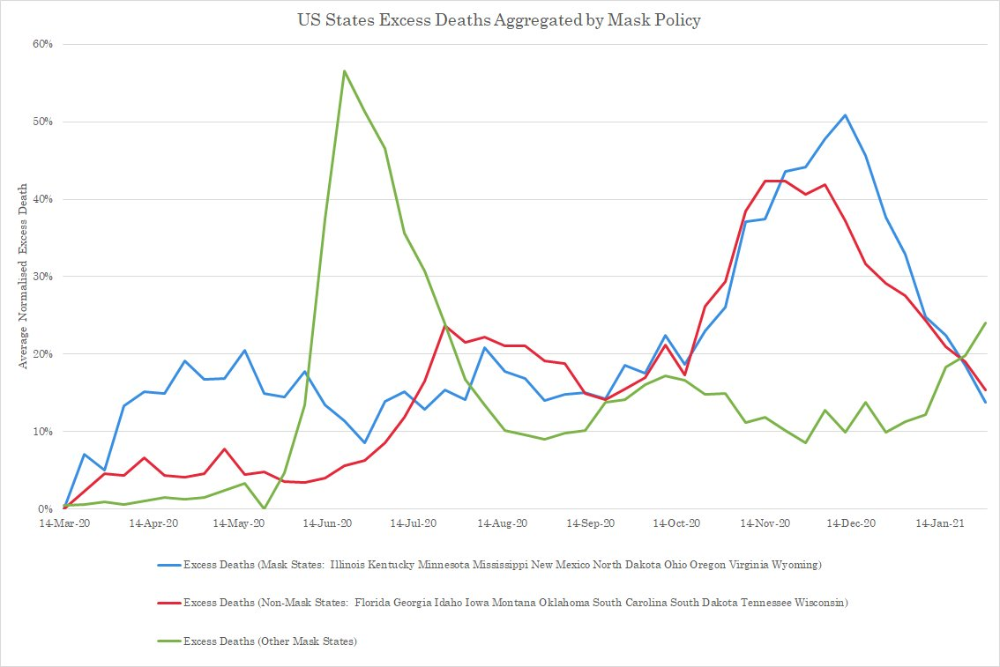
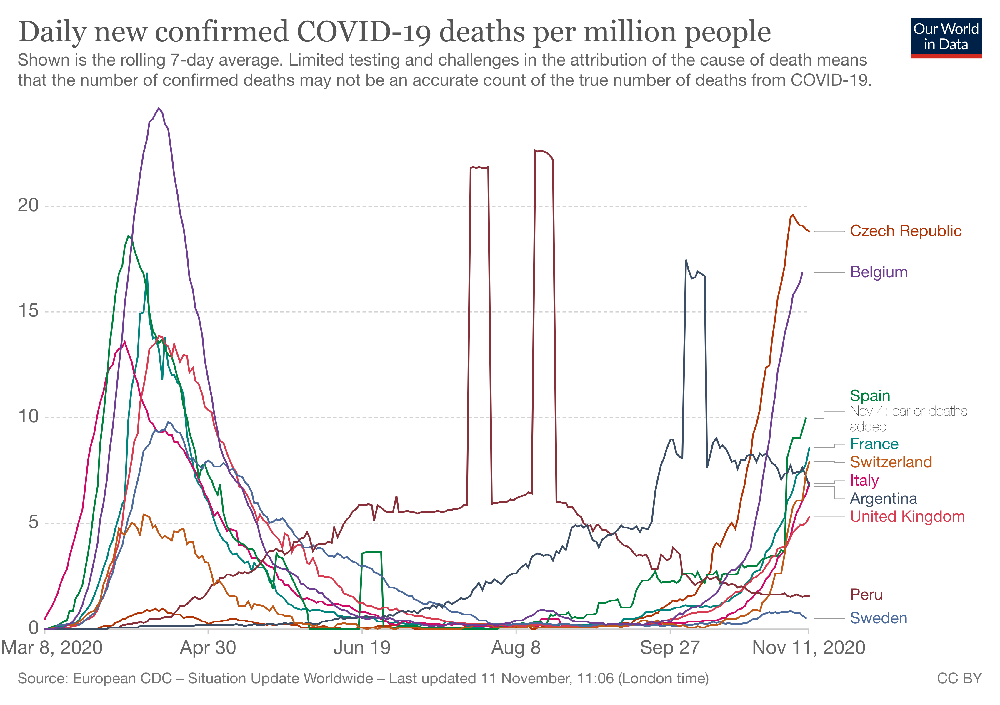
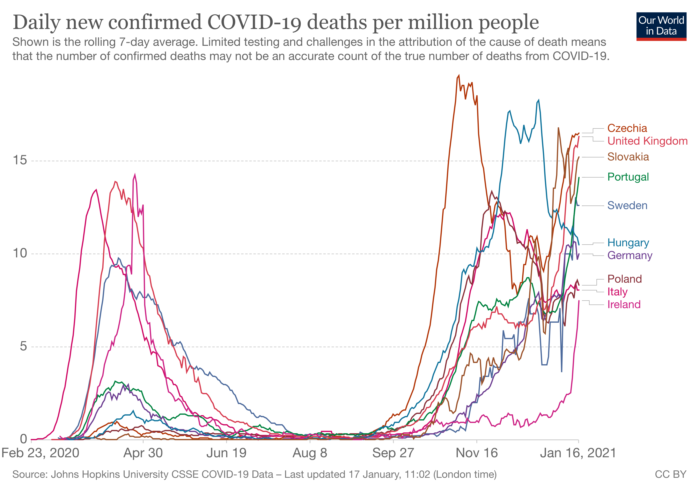
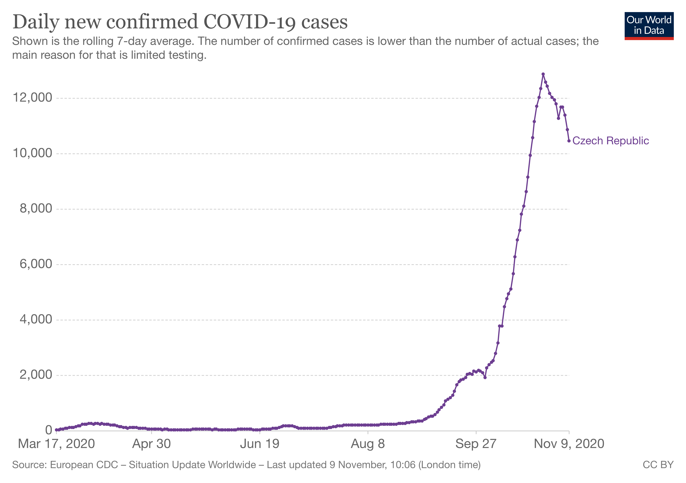
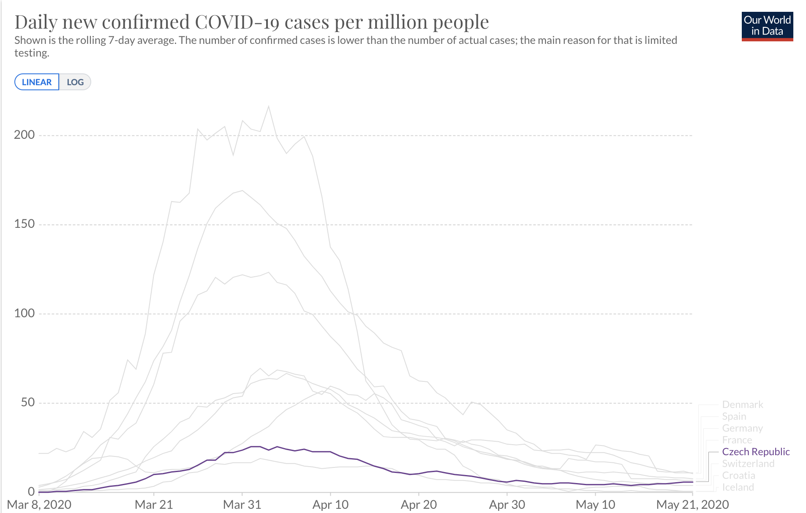
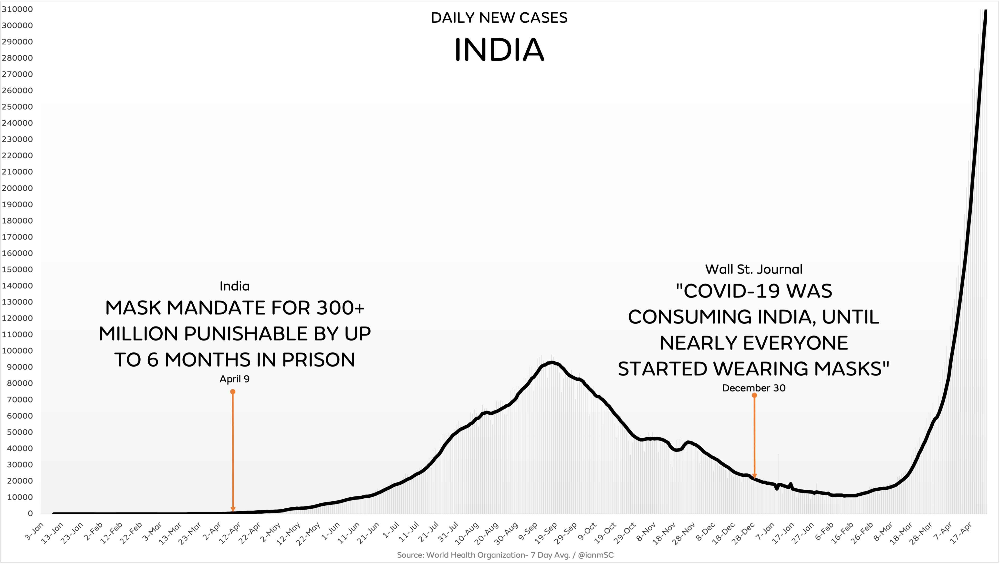

_Note: The case/death numbers in this article are per million people,
to make it easier to compare countries with different population
densities._

NPI: _Non-pharmaceutical intervention_

### The conventional wisdom has rarely been this wrong

If you surveyed a random sample from all around the world about COVID-19, most of the surveyed would have no idea that:

- [A multitude of (35+) studies](https://www.aier.org/article/lockdowns-do-not-control-the-coronavirus-the-evidence/) [conducted on lockdowns](<https://www.thelancet.com/journals/eclinm/article/PIIS2589-5370(20)30208-X/fulltext>) [showed they have little to no effect](<https://www.jclinepi.com/article/S0895-4356(21)00087-1/fulltext#.YGIHDE_qYSY.twitter>) on the virus trajectory

https://twitter.com/the_brumby/status/1349478825747365889

- A look on the COVID responses of 166 countries shows no correlation between NPI stringency and deaths per million
  

- There are many places that have lifted all NPI restrictions, and it had no effect on their COVID trajectory. Texas is a high-profile recent example, which lifted all restrictions and mask mandates, and even hosted a sold out, full capacity baseball game, yet hospitalizations kept dropping:

https://twitter.com/ianmSC/status/1384612787620487171

- There was no correlation between mask mandates and [excess deaths](https://en.wikipedia.org/wiki/Mortality_displacement) in the US.

  

- Mask mandates have failed to make any meaningful difference on the virus trajectory [nearly everywhere they were introduced](https://rationalground.com/post-thanksgiving-mask-charts-still-no-evidence-that-masks-work/), [even in the most adherent populations with 96+% compliance](https://dossier.substack.com/p/everyone-is-already-wearing-a-mask).

- The only randomized controlled trial (considered the [gold standard](https://www.ncbi.nlm.nih.gov/pmc/articles/PMC6235704/) of study types) showed [no significant effect for face masks reducing transmission](https://www.acpjournals.org/doi/10.7326/M20-6817).

- [12 of the 15 countries](https://ourworldindata.org/explorers/coronavirus-data-explorer?zoomToSelection=true&time=2020-02-27..latest&pickerSort=desc&pickerMetric=total_deaths_per_million&Metric=Confirmed+deaths&Interval=7-day+rolling+average&Relative+to+Population=true&Align+outbreaks=false&country=CZE~SVK~HUN~BEL~SVN~ITA~GBR~PER~USA~POL~PRT~HRV~MEX~ESP~BRA) with the worst death rates had nationwide mask mandates, and the other 3 (Brazil, Mexico, and USA) had mask mandates in most of their states.

- Even "stronger" FFP2 mask mandates failed to prevent further surges in Germany

https://twitter.com/ianmSC/status/1383115292625174537

- [Mortality rate (IFR) for individuals under 20 is 0.001%, and for individuals under 50 is 0.01%](https://www.nature.com/articles/s41586-020-2918-0/figures/2).

- The above rate is an overall average, and your survival odds increase dramatically if you maintain a healthy weight. Obese patients are [61 percent more likely to die than those who were at a healthy weight](https://www.cdc.gov/mmwr/volumes/70/wr/mm7010e4.htm). This discrepency is especially pronounced amongst patients under 65.

- Children are at an especially low risk from COVID-19. Sweden kept schools open throughout the pandemic, [and not a single child died of COVID-19](https://www.nejm.org/doi/full/10.1056/NEJMc2026670), out of 2 million students.

- Outdoor transmission is extremely low risk. An [irish study](https://www.irishtimes.com/news/ireland/irish-news/outdoor-transmission-accounts-for-0-1-of-state-s-covid-19-cases-1.4529036) of 232,164 cases found that only 0.1% were a result of outdoor transmission.

- There is [very little evidence](https://www.hartgroup.org/wp-content/uploads/2021/03/240321-Updated-HART-review.pdf) that asymptomatic transmission plays a big role in spreading the virus:

  > The case studies cited as evidence of asymptomatic transmission amount to just 6
  > individuals who were alleged to have spread COVID-19 to 7 other people

Keep in mind that the whole rationale for lockdowns and mass masking & testing of healthy people is the assumption that "they can still spread the virus".

## Correlation is not Causation, but Causation IS Correlation

To say that a measure is effective in changing a metric, you have to
prove a causal relationship between the two events (A causes B). This usually
starts by showing a correlation (When A happens B happens). So to
prove that lockdown measures work, you first have to show a
correlation between the introduction of such measures, and the
decrease in death/hospitalizations that occurs next.

Since we have many countries that have imposed lockdown restrictions,
and one that hasn't (Sweden), we can do a comparison to isolate the
effect lockdowns had on coronavirus deaths.

In this chart, we can see that comparison. Note that these countries
come from various geographical locations, with various population
densities. The only constant between them is that they had a high
number of COVID-19 cases, and they tried to curb that by imposing
lockdown measures.

Now, let's take a closer look at some of the countries in the chart:

### In South America

[Peru imposed one of the world's toughest lockdowns when there were
only 28 confirmed
cases](https://www.telegraph.co.uk/news/2020/10/18/peru-has-toughest-lockdown-world-still-ended-worst-fatality/),
and still ended up with the world's 2nd worst death rate.

[Argentina had a
220 day(!)
lockdown](https://www.washingtonpost.com/world/the_americas/coronavirus-argentina-million-quarantine-lockdown/2020/10/26/65eefde2-149c-11eb-bc10-40b25382f1be_story.html),
and came out of it with the world's 7th worst fatality
rate. Its president had infamously said in May: ["If we open the
economy, we will end up like Sweden
did."](https://twitter.com/charliebilello/status/1318392740506439685)

### And over in Europe

Spain, Italy and France had imposed
[infamously](https://www.theguardian.com/world/2020/apr/18/silent-trauma-of-children-facing-the-strictest-lockdown-in-europe)
[strict](https://www.nbcnews.com/news/world/coronavirus-italians-adjust-new-reality-under-lockdown-n1157606)
[lockdowns](https://www.euronews.com/2020/03/20/coronavirus-in-france-what-can-you-actually-do-in-lockdown-time)
in Europe in the first wave. Belgium, Switzerland and the UK also
locked down during the first wave.

The reality is, looking at the chart again, we could clearly see that
regardless of the lockdown measures they took,
all European countries peaked around the first two weeks of April, and more
or less went to zero by the summer.

## The (in)efficacy of masks

Now onto masks. To observe the effect of mask mandates, I've picked the first European 2 countries to
impose mask mandates (Czech & Slovakia), as well as 7 other countries with
some of the highest mask compliance in Europe, according to [the
Coronavirus Government Response
Tracker](https://www.bsg.ox.ac.uk/research/research-projects/coronavirus-government-response-tracker/)
(Italy, UK, Hungary, Portugal, Germany, Poland, Ireland). Most of these countries require wearing [face](https://spectator.sme.sk/c/22507697/masks-outdoors-no-mass-events-special-hours-for-seniors-slovakia-reintroduces-strict-measures.html)
[masks](https://www.bbc.com/news/world-europe-54454450) [at](https://www.thelocal.de/20201022/these-10-berlin-streets-require-a-face-mask-be-worn)
[all](https://notesfrompoland.com/2020/10/08/poland-makes-masks-compulsory-outdoors-as-government-declares-whole-country-covid-yellow-zone/)
[times](https://www.reuters.com/article/us-health-coronavirus-portugal-idUSKBN2781WS),
[even](https://www.bloombergquint.com/onweb/hungary-to-make-mask-wearing-mandatory-in-all-public-spaces) [in](https://www.thelocal.ch/20201029/switzerlands-new-mask-requirement-everything-you-need-to-know)
[outdoor](https://www2.hse.ie/conditions/coronavirus/face-coverings-masks-and-covid-19/when-to-wear.html)
[spaces](https://www.expats.cz/czech-news/article/breaking-face-masks-to-be-mandatory-outdoors-as-of-wednesday-in-the-czech-republic).

For context, I'm again comparing them to Sweden, where face masks were
never required. If the mask hypothesis were true, then coming into the
second wave, surely we'd
expect Sweden to be ravaged by coronavirus deaths, and the countries
with most mask compliance facing minimal damage.

---

**Czech Republic** was Europe's first country to impose a mask mandate, requiring
citizens to wear a mask everywhere outside their home as early as
March 18, when it had just ~40 daily cases.

[It was hailed and used as an
example for the rest of the world to
follow](https://eu.usatoday.com/story/opinion/2020/04/04/czech-government-implemented-face-mask-requirement-help-combat-coronavirus-column/2940393001/).
Cases peaked just 2 weeks after imposing masks, then kept dropping
steadily. On its face, that's substantial evidence of the efficacy of masks.

[The Czech declared victory in May and lifted the mask
mandate](https://www.theguardian.com/world/2020/may/25/czech-republic-face-mask-coronavirus-restrictions-pubs-restaurants-hotels).
They had successfully defeated the virus.

But then in August, cases started spiking, reaching 350 daily cases by
the start of September. The government "had no option" but to
[reintroduce the mask mandate on September
2](https://medicalxpress.com/news/2020-09-czechs-reintroduce-masks-indoors-virus.html).
If the previous time was any indication, cases would peak 2 weeks
later and drop off again.

Except they didn't.

Cases continued rising exponentially, reaching 13,000 daily cases by
the end of October (47 times higher than the spring peak).

How did this happen? If masks worked so well the first time, why
didn't they work the second time around?

With a closer look at the original drop off (and the benefit of
hindsight), We can see
how this is a textbook example of [correlation being confused with
causation](https://en.wikipedia.org/wiki/Correlation_does_not_imply_causation). When put in context with other
European countries that did not impose an early mask mandate, we can
see the cases peaking at almost exactly the same time, which suggests
the virus was going to peak around then regardless of any government mandate.

---

**Slovakia** was Europe's second country to impose a mask mandate, also in
March. Within 10 days of identifying its first case, Slovakia went
into lockdown .Its leaders were "leading by example", as "no Slovak politician,
journalist, or public figure is seen in public without a mask". [_The
Atlantic_ urged other world leaders to
take
lessons](https://www.theatlantic.com/international/archive/2020/05/slovakia-mask-coronavirus-pandemic-success/611545/).
They did all the right steps, intervening early and firmly.

.

Then the second wave hit, this time more seriously, cases rose
exponentially, and the same government could do nothing to contain it. A closer look
at the full chart suggests that the virus arrived to Slovakia at the end of its season and didn't
spread much, and its effect waned in the summer, like most European
countries. These factors could well have been why the virus didn't hit
hard the first time around, not the measures taken by the government.

---

India is another example, which was hailed for [beating the pandemic after "Nearly Everyone Started Wearing Masks"](https://www.wsj.com/articles/covid-19-was-consuming-india-until-nearly-everyone-started-wearing-masks-11609329603), yet cases and deaths exploded in a true tragedy.

## Conclusion

Sweden never closed any businesses, it never closed schools, and it
never enforce arbitrary rules for whom its citizens can meet with,
what they can do, and what they have to wear. They followed the
evidence where it led them, communicated it with the public, and
trusted them to act responsibly.

One factor that might explain the initial peak in deaths in Sweden is
the "dry tinder" theory, which hypothesizes that because Sweden had an
unusually mild flu season the previous two years, there was a higher
number of susceptible
Their big mistake was the initial
failure to adequately protect care homes, which accounted for half the
deaths.

Instead of doubling down on a flawed strategy, [they admitted
their
mistake](https://www.france24.com/en/20200510-sweden-admits-failure-to-protect-elderly-in-care-homes),
and banned nursing home visits, [a ban that lasted for six
months](https://www.reuters.com/article/us-health-coronavirus-sweden-nursinghome-idUSKBN26M73C).
That's one factor that might explain their very low death rate since
the summer, even when cases kept rising.

It has now been
109 days since Sweden had more than 1 daily deaths from COVID-19. As
most European countries scramble toward a second lockdown, the
contrast could not be more pronounced. Instead of looking at the

Sweden is one of the very few countries that did not impose
restrictions to fight COVID-19, and it's certainly the highest profile
one. Sweden has had <1 death/day since **July
17** (109 days ago). That's incredible, because we know it has had a
high infection rate (Sweden has a higher case rate than Italy), so
it's clearly not a function of the virus never getting there in the
first place.

I'm not writing
