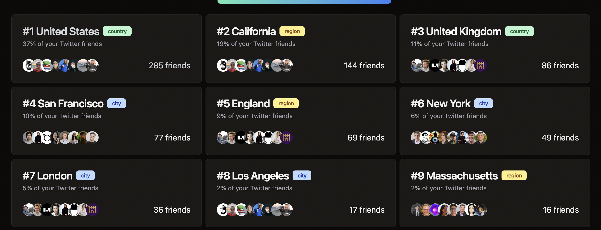

In the era of remote work, the concept of "home" has evolved beyond geographic boundaries to fundamentally encompass community. This shift led me to create [Tribe Finder](https://tribefinder.app), a tool that leverages your Twitter network to identify cities that resonate with your personal and professional ethos, simplifying the journey to find your ideal community.

## Inspiration Behind Tribe Finder

**Inspired by [Paul Graham](https://x.com/paulg)'s [Cities and
Ambition](https://www.paulgraham.com/cities.html)**, I recognized that cities attract specific types of ambitious individuals through unique cultural messages. Noting that these messages and the cities themselves evolve, Tribe Finder uses real-time Twitter data to connect you with communities that share your values and aspirations. It's about more than just finding a place to live; it's about discovering where you can grow alongside people who inspire you.

Living in a city populated by people who inspire you and share your goals is not just desirable—it's
essential for personal and professional growth. Tribe Finder eliminates the guesswork in locating
such communities, focusing not on mere geographical data, but on the essence of community culture
and connection.

---

**Devon Zuegel's [Small World](https://smallworld.wiki)**, a tool mapping Twitter friends, served as another
significant inspiration for Tribe Finder.

<blockquote class="twitter-tweet">
I built a little tool – it&#39;s called Small World, and it helps you make new friends and stay in touch with old ones: <a href="https://t.co/DuPoDA1GQx">https://t.co/DuPoDA1GQx</a>  it&#39;s like a Marauder&#39;s Map, but for the people you follow on Twitter <a href="https://t.co/EIW3enaWdt">pic.twitter.com/EIW3enaWdt</a>
&mdash; Devon ☀️ (@devonzuegel) <a href="https://twitter.com/devonzuegel/status/1534595292485623808?ref_src=twsrc%5Etfw">June 8, 2022</a></blockquote>

Small World focused on a map UI, while Tribe Finder is starting with a list view of the most popular
cities among your Twitter network.

Unfortunately, Small World is no longer active due to the Twitter API changes, and that left a gap
for Tribe Finder to fill.

## Personal Motivation

Driven by a fascination with crowd-sourced data, I sought to answer the "Where should I live?" question on a more empirical basis. Traditional metrics like weather or cost of living are useful, but I envisioned a tool that could offer insights based on the collective experiences and opinions of like-minded individuals. The goal was to create a platform that could harness the nuanced, real-time preferences of individuals, providing a more accurate reflection of community satisfaction and alignment with personal values

In my opinion, websites like Numbeo/Nomad List are great for getting some facts about a city, but in
the end, these "Quality of Life" indexes do not answer the most important questions:

#### **Which cities have have the highest satisfaction rate among people who live there?**

A city having a
low crime rate does not tell me much about how happy I will be living there. But a city where most
residents (_especially non-natives_\*) are happy is a better indicator, because I'm more likely to be
happy there too, and because they likely wouldn't be happy if the place had a high crime rate, was
too expensive, etc.

**\*_Why exclude natives?_** Because most people never leave the reigon they were born in. Moving to a new
place is a very expensive decision, both financially and emotionally, so the bar is just too high
for most people. Ideally, we want to know only the opinions of people who were actively looking for
a city to move to, and among these, where they ended up and how happy are they there.

#### Where are the people I admire/like or do what I want to do living?

this is highly personalised, and this is what Tribe Finder tries to answer

## How is Tribe Finder Different?

Tribe Finder stands out from data-centric platforms like
[Numbeo](https://www.numbeo.com/quality-of-life/) by
focusing on personal connections and community culture. It helps you discover where your Twitter
friends, who share your aspirations and interests, are thriving. This level of personalization sets
Tribe Finder apart as a unique tool for finding your sense of belonging.

## Understanding Tribe Finder with an Example

Consider the case of Paul Graham, a figure synonymous with the tech world. A significant portion of his Twitter network is concentrated in the San Francisco Bay Area, reflecting his influence and interests within the tech community.

This example illustrates how Tribe Finder can pinpoint the geographical concentration of your Twitter network, suggesting where you might find like-minded individuals and opportunities.

Your interests and goals might differ from Paul Graham's, but the concept remains the same.

> _Tribe Finder utilizes publicly available Twitter location data, respecting user privacy and adhering_ _to Twitter's privacy policy. It focuses solely on public profiles without storing any personal data._

By analyzing your Twitter network, Tribe Finder helps you uncover where your "tribe" resides, making
it easier to find communities where you'll thrive, both personally and professionally.

By proxy, the top cities in your Tribe Finder results are the ones where you're most likely to find
interesting job opportunities, make new friends, and feel at home. It's a tool that helps you make informed decisions about where to live, work, and grow.

## Limitations

- Tribe Finder does not work for users with private Twitter accounts.
- It only takes into account users who chose to share their location on Twitter. Many users use the
  location field to self promote or as a joke, and these are usually excluded.

  

- If a user has multiple different locations in their profile, Tribe Finder tries its best to
  include them all. For example, the user below will be counted as living in both New York and Austin.

  

- Tribe Finder uses an "unofficial" Twitter API at the moment, which might break at any given
  moment. Unfortunately, the official Twitter API is far too expensive for a hobby project like
  this.

## The Tech

Built with Next.js, Tailwind CSS, and [shadcn/ui](https://ui.shadcn.com/). Tribe Finder utilizes this
[Next.js Chrome extension
template](https://github.com/Pondorasti/nextjs-chrome-extension).

Mapbox Geocoding API is used to convert the location strings from Twitter to accurate locations/coordinates.

## The Future of Tribe Finder

Currently available as a Chrome extension in its MVP phase, Tribe Finder's future developments
depend on user feedback and demand. I purposefully wanted to start with a Chrome extension, as it
runs 100% locally, with no need for server or database costs.

Future plans include a web app expansion to broaden accessibility and
features like city/state/country filters, a map view, and more.

## Conclusion

I made tribe finder to answer the question "Where should I live?" in an empirical way, starting from
people as the most decisive factor.

I think your Twitter network is unique in that, you choose to
follow people you like or whose takes you find interesting. This is a very strong signal, unlike
Facebook/Instagram/LinkedIn where you are more likely to follow people you know in real life,
regardless of how much you actually find them interesting.

I hope you find Tribe Finder useful, and I'm looking forward to your feedback!

<!-- ### Digression

It is my belief that the most valuable piece of information you can arm yourself with before making a
decision is to see how satisfied people who are similar to you\* who made the same decision about
said decision. This applies to everything from cities to live in, to movies to watch, products to buy,
etc.

But as far as I know, there is no such tool that can answer such questions. The closest thing we
have is implicit data. People living in a city are implicitly saying "I like living here", because
otherwise they'd move. This is not perfect, because people are not always free to move, but it's
something we can work with.

> \* in an ideal world, we have perfect (anonymised) information about everyone, and we can answer such questions
> empirically.
>
> For example, "How happy are males around my age, who have a similar income to me, a
> pet, and a family, who moved from a city with a similar climate to mine, to New York City?"
>
> We don't live in such a world (yet), so we have to make do with whatever imperfect data we have. -->
